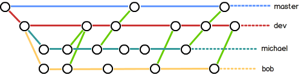

#### 开发标准

- master：主分支用来版本发布
- develop：日常开发分支，分支正常保存了开发的最新代码
- feature：具体的功能开发分支，只跟 develop 分支交互
- release： release 分支可以认为时 master 分支的未测试版本。比如一期的功能全部开发完成，那么就将 develop 分支合并到 release 分支 ，测试没有问题了并且到了发布日期就合并到 master 分支，进行发布。
- hotfix：线上 bug 修复分支。

**在实际开发中，我们应该按照几个基本原则进行分支管理：**
首先，master分支应该是非常稳定的，也就是仅用来发布新版本，平时不能在上面干活；

那在哪干活呢？干活都在dev分支上，也就是说，dev分支是不稳定的，到某个时候，比如1.0版本发布时，再把dev分支合并到master上，在master分支发布1.0版本；

你和你的小伙伴们每个人都在dev分支上干活，每个人都有自己的分支，时不时地往dev分支上合并就可以了。





------


#### 配置

首次使用 GIT 配置全局信息 ，commit时的签名

```bash
	git config --global user.name "Name"
	git config --global user.email "email@examlp.com"
```

> 查看：git config -l


------

#### 建立本地仓库

```
git init
```

- 暂存区 （`stage`/`repository`）:一个临时的储存区域
- 版本库 （`repository`）:代码提交记录存储区

#### 添加修改过的文件到暂存区

- ​	git add
  - `git add xxx.js`  // 添加单个指定文件
  - `git add src/`     // 添加一个目录
  - `git add .`          // 添加所有修改过的文件到暂存区

#### 提交到版本库

```
git commit -m "备注"
```

> 如果不加 -m 会进入git bash 自带的vim编辑器


#### clone

```
git clone ipaddress
```

#### push

```
git push origin master
```

#### pull （拉取+合并）

```
git pull origin master

// 等效于
git fetch origin master
git merge origin/master
```

#### fetch （单拉取）

```
git fetch 仓库名 分支
```

#### merge （单合并）

```
git merge 仓库名 分支
```


#### status

查看git目前状态 比如是否有文件修改但未推送之类的

有三个状态码：

- untracked
- unstaged
- uncommitted

但我不懂怎么看  都add进去就好了

```
git status
```


------

#### ssh

配置好 公钥 密钥 之后

```bash
ssh -T git@github.com
```

------

#### 关联本地仓库与远程仓库

- 添加

  ```
  git remote add origin git@github.com:xxx/view.git
  // origin : 远程仓库名
  ```

- 删除

  ```
  git remote remove 远程仓库名
  ```

  

------

#### 版本回退 （回滚）

- `git resret --hard HEAD^`

- `git reset --hard [commit id]`

  > commit id （版本号）没必要全写  写几位 让git自己查找

  参数说明：

  - `--hard`        :工作区、暂存区、版本库的文件同时回退
  - `--mined`  		:(默认) 暂存区、版本库的文件回退
  - `--soft`		:仅回退版本库中的文件
  
- 当前版本：`HEAD`

  - 上一个版本：`HEAD^`

  - 上上个版本：`HEAD^^`

    ......  		以此类推

  - 前100个版本：`HEAD~100`

- 显示提交日志：`git log`

  > 一大串类似`3628164...882e1e0`的是**commit id**（版本号）
  
  
    * `--pretty=oneline`（显示简要信息id+备注）
    * `--graph`（图形显示版本走向）
    * `--abbrev-commit`（显示简写的id）
  
- 查看命令历史: `git reflog`

- 撤销文件修改

  - `git checkout -- <file>` ：放弃工作区的修改
  - `git rm --cache <file>`：撤销暂存区的修改
  - `git reset HEAD <file>`：撤销暂存区的修改

- 对比文件：`git diff <file>`

------

#### 配置git过滤清单

> 一般来说每个Git项目中都需要一个“`.gitignore`”文件，这个文件的作用就是告诉Git哪些文件不需要添加到版本管理中。

```
    #过滤dist根目录下的文件（不过滤其他目录下的dist文件夹）
    /dist 

    #过滤所有node_modules文件夹
    node_modules/

    #过滤所有.zip文件
    *.zip 

    #过滤某个具体文件
    /mtk/d.doc
```

#### 分支

- 创建分支：`git branch 分支名
- 切换分支：`git checkout 分支名`

> 以上两步合并为：`git checkout -b 分支名`

- 查看分支：`git branch`

  > 列出所有分支，当前分支前面会标一个*号

- 合并分支：`git merge 分支名`

  - `Fast-forward`：快速合并

  * `--no-ff`: 禁用快速合并（保持分支信息）

  > 合并要创建一个新的commit，所以加上-m参数，把commit描述写进去

- 删除分支：`git branch -d 分支名`

  > 强行删除，需要命令 `git branch -D feature-vulcan`

- 同步远程分支到本地

  1. 先获取（git fetch）
  2. 然后在本地创建一个同名分支，将远程分支映射到这个分支上：`git branch dev origin/dev`

